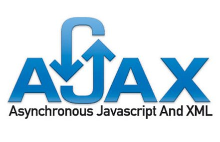

<h1 align="center">Hi, welcome to my github  
     I'm Omid Daryaei  
</h1>

    

 
  Visitors counter 
  

<h2>Contact me:</h2>

    
    

<h2>Languages & Tools:</h2>

 
    

   

<h2 align="center">☺ HOPE TO SEE YOU AGAIN ☺</h2>

    

<!--
**omid-d94/omid-d94** is a ✨ _special_ ✨ repository because its `README.md` (this file) appears on your GitHub profile.

Here are some ideas to get you started:

- 🔭 I’m currently working on ...
- 🌱 I’m currently learning docker
- 👯 I’m looking to collaborate on ...
- 🤔 I’m looking for help with ...
- 💬 Ask me about ...
- 📫 How to reach me: ...
- 😄 Pronouns: ...
- ⚡ Fun fact: ...
-->

